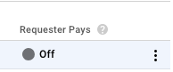
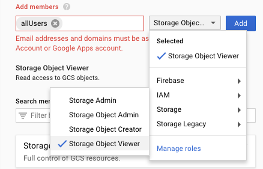

## Guide public bucket

### 1. Google Cloud Storage configuration

- Access the link:
  https://console.cloud.google.com/storage/browser?project=<project_id>
- Choose `Storage` and do like the images below

[](Screen Shot 2018-11-01 at
4.56.07 PM.png)

[](Screen Shot 2018-11-01 at
4.55.38 PM.png)

- Copy private-key to `./server/config/<file_private_key>.json` and commit to
  source code (security issue here, need a better way!)

- Config .env file or environment variable setting on cloud hosting to have
  correct environment variables for Google Cloud Storage

```
STORAGE_PROVIDER=google
STORAGE_GOOGLE_KEY_FILE_NAME=./server/config/<file_private_key>.json
STORAGE_GOOGLE_PROJECT_ID=<project_id>
```
